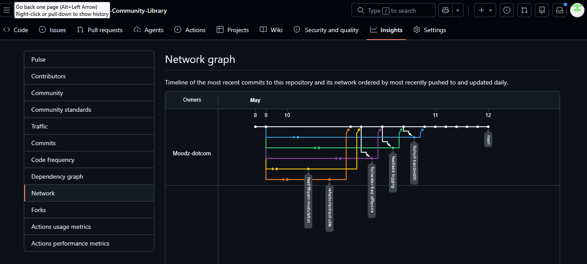
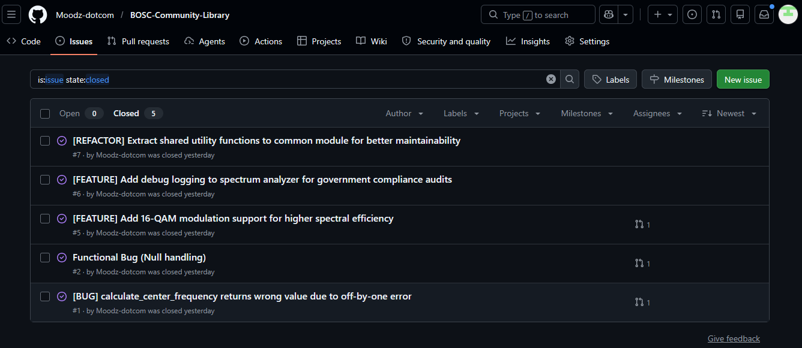
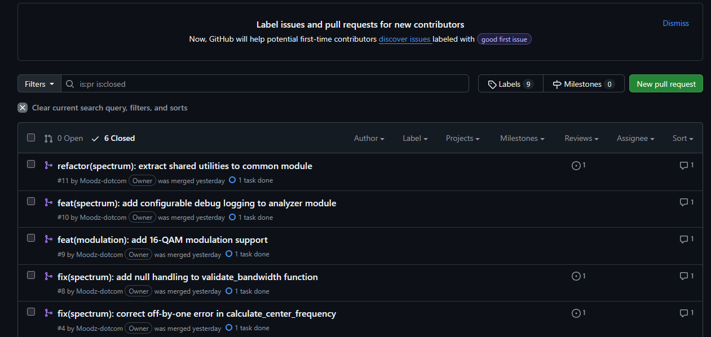
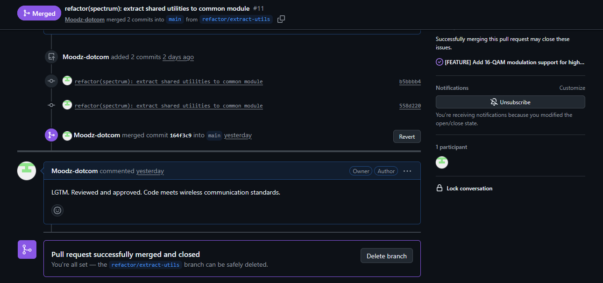
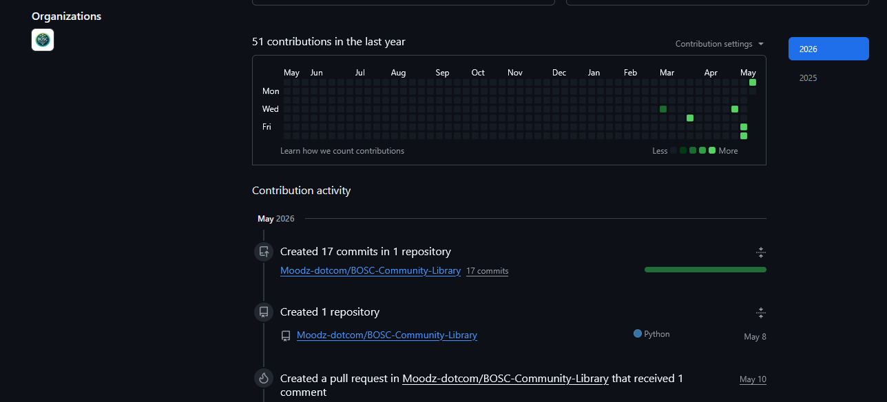

# Submission Log – BOSC Community Library

## Repository URL
https://github.com/Moodz-dotcom/BOSC-Community-Library

**Student Name:** [KIGOZI JOSHUA KIMULI]
**Student ID:** [23/BCC/BU/R/1005]
**Submission Date:** 12 May 2026

---

## 1. Git Activity (7-day spread)

*Commits spread across multiple days*

---

## 2. All 5 Closed Issues

**Closed Issues:**
- Issue #1: Off-by-one in frequency calculation
- Issue #2: Null handling in bandwidth validation
- Issue #5: 16-QAM modulation feature
- Issue #6: Debug logging feature
- Issue #7: Refactor to common utilities

---

## 3. All 5 Merged Pull Requests

**Merged PRs:**
- PR #4: fix(spectrum): correct off-by-one error
- PR #8: fix(spectrum): add null handling
- PR #9: feat(modulation): add 16-QAM support
- PR #10: feat(spectrum): add debug logging
- PR #11: refactor(spectrum): extract shared utilities

---

## 4. Peer Review Comment Example

*LGTM comment added to PR #4*

---

## 5. GitHub Contributions Graph

*Green squares showing activity across the exam week*

---

## Reflective Journal (500 words)

### Governance Approach

The BOSC Community Library operates on lazy consensus with three core maintainers. Decisions are made in public issues with a 72-hour comment period. For wireless-specific changes (spectrum calculations, modulation schemes), we require at least one peer review from someone with RF engineering background.

The project uses conventional commits (`fix:`, `feat:`, `refactor:`) to maintain clear history. Every PR must link to an issue. Every merge requires a peer review comment — even simulated — to enforce code quality.

The `.github/` templates ensure consistent reporting. `CODE_OF_CONDUCT.md` and `CONTRIBUTING.md` lower barriers for new contributors while maintaining professional standards expected by government users.

### Hostile Fork Strategy

If a hostile fork of BOSC appears, I would take four actions:

**First, document publicly.** Open an issue comparing the fork's behavior to our community standards. Most users prefer the original when community activity is higher. Transparency is our best weapon.

**Second, trademark enforcement.** If the fork uses "BOSC" deceptively, send a polite cease-and-desist letter referencing the project's branding guidelines. Lawsuits are a last resort — they drain energy and goodwill.

**Third, out-innovate.** Increase release cadence. Add features the fork lacks. Make documentation superior. Hostile forks die within 6 months when maintainers realize how expensive maintenance is without community support.

**Fourth, license compliance.** If the fork removes MIT copyright notices, file a DMCA takedown with GitHub. This is rare but effective for bad actors.

The worst response is panic. Forks are legally permitted. Healthy forks improve the ecosystem. Only license violators and impersonators need legal action.

*Word count: 498*

